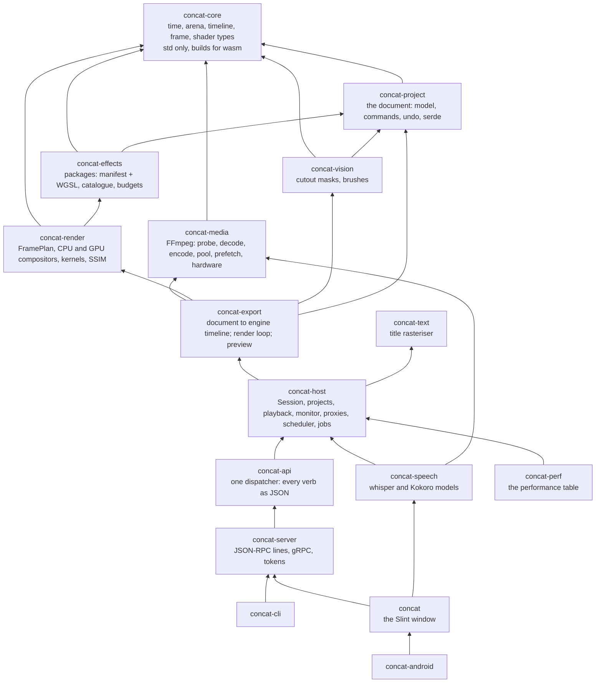
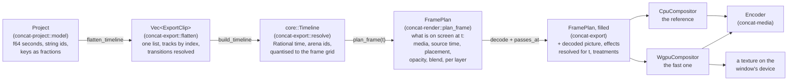
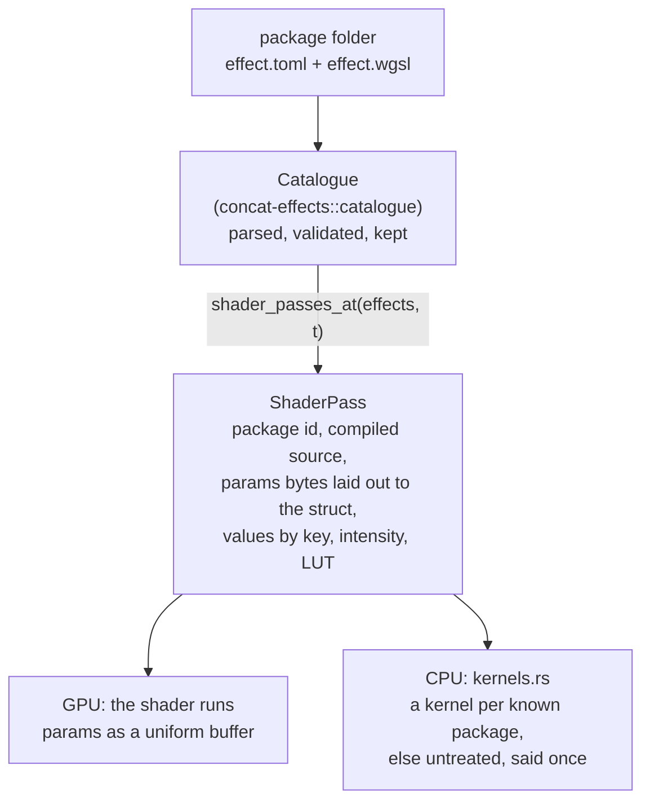
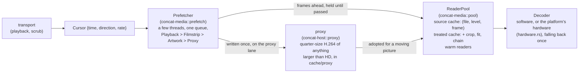
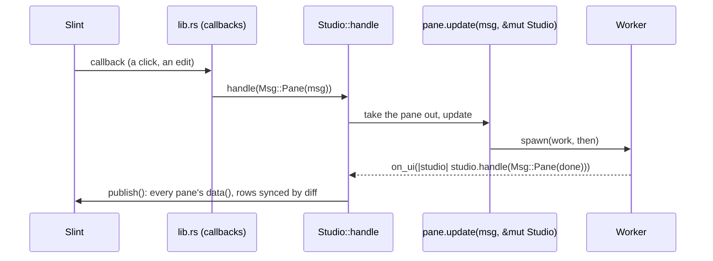
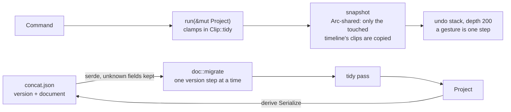
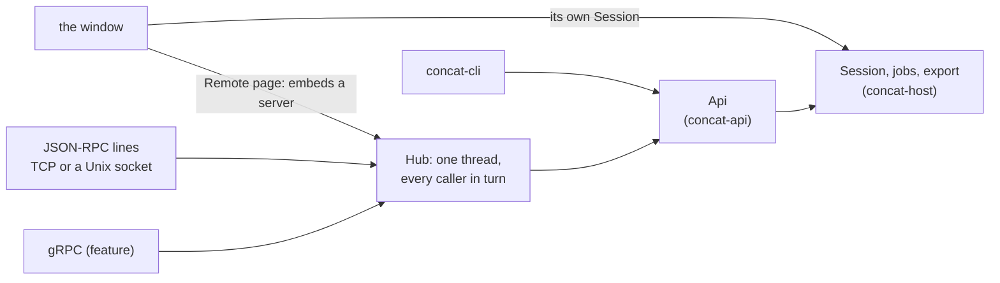

# How Concat works

A map of the engine and the window for someone who wants to change one part
without reading the rest. Every section names the crate and the file to open
when the picture is not enough. Diagrams are Mermaid, which GitHub renders.

Concat is a video editor in Rust. The engine is a set of crates with no window
in them; the window is a Slint application over that engine; a command-line
tool and a socket server drive the same engine through the same API the
window uses. One document format, one command set, one renderer, three ways
in.

## 1. The crates and who depends on whom

Every arrow points one way: nothing lower knows the window exists, and the
engine's core knows nothing about FFmpeg.

`concat-core` and `concat-project` build for `wasm32`, which CI checks; the
FFmpeg boundary is `concat-media` and nothing else links it.

## 2. From the document to a pixel

A clip exists in three shapes on its way to the screen, and each crossing is
one function in one file.

- **The document** (`concat-project/src/model.rs`) is what a person edits and
  what is saved. Times are seconds, ids are strings, and every keyframe is a
  fraction of its clip's length. Every change goes through a `Command`
  (`commands/`), and the `Editor` (`editor.rs`) keeps undo as snapshots that
  share whatever a command did not touch.
- **Flatten and resolve** (`concat-export/src/flatten.rs`, `resolve.rs`) turn
  the document into the engine's `Timeline`: rational time, quantised to the
  frame grid so `f64` equality is exact, plus the per-clip facts the model has
  no field for (decode sizes, filter chains, cutout jobs, layer treatments).
- **The plan** (`concat-render/src/plan.rs`) is pure: no files, no pixels. It
  says what is visible at one instant and where. The export fills it with the
  decoded picture, the effects resolved for that instant, and the treatments
  live over the stack, and hands the whole thing to a compositor, which takes
  a `FramePlan` and nothing else.
- **Two compositors, one description.** The CPU one is the reference and the
  fallback; the GPU one must match it, and the parity suite
  (`concat-render/src/gpu/tests.rs`) holds it to a structural similarity
  above 0.99 on a plan per thing a frame can ask for. Geometry (crop, fit,
  centre, scale, turn) and weighing (fades folded into a scale and offset,
  wipes into edges, mask, opacity) are computed once in the plan so the two
  cannot drift.

Still baked into the decoder's FFmpeg chain rather than filled into the plan
by the export: the crop, the flips and the transition fades. The plan has the
fields; the tests fill them; the export does not yet.

## 3. Effects

An effect is a folder under `concat-effects/packages/`: a manifest
(`effect.toml`) naming its knobs, a WGSL shader (`effect.wgsl`) declaring a
`Params` struct and `fn effect(uv)`, and an FFmpeg chain template for audio
and for the CPU path's history.

At load, `concat-effects/src/shader.rs` stitches the host's prelude round the
package body, parses and validates it with naga, reads the `Params` layout for
the uniform buffer, and refuses a shader that binds anything the host did not
declare or loops without a break. A look-up table larger than 65 a side is
refused too, and a binding declared as anything other than what the host
puts there, and a chain that names a file other than its own `{lut}`. When
the window loads the user's packages it runs each one's shader once on the
GPU over a 512-pixel picture against a three-second timeout
(`Catalogue::install_with`, `WgpuCompositor::trial_at`) and leaves out one
that fails; a pipeline the driver refuses at draw time is caught in an
error scope and the pass skipped, never an uncaptured error.

## 4. Decoding, caching and scheduling

Export decodes every frame once, in order, with one decoder per clip. Everything
interactive goes through the pool and the scheduler.

- **The source cache** is keyed by the file, the level it was decoded at (the
  file's own size halved as long as it still covers what was asked for) and
  the frame index, and nothing else. The crop, the fit and the effect chain
  are applied to the cached picture on the way out and kept in a second,
  smaller cache, so turning a knob costs a filter per frame and a scrub back
  over covered ground costs a lookup.
- **The scheduler** is one per process (`concat_host::scheduler()`). The
  monitor's frames and the frames ahead of the playhead come first, then the
  lanes' filmstrips, the bin's artwork and proxies, on two to four threads
  with one always kept clear of background work, so an import of twenty files
  never runs twenty decoders at once.
- **Hardware decode** (`concat-media/src/hardware.rs`) is a process-wide
  preference the Settings switch sets: VideoToolbox on a Mac, D3D11VA on
  Windows, MediaCodec on Android, VAAPI only when named. Any failure falls back
  to software, logged once.
- **Audio** for playback (`concat-host/src/playback.rs`) is decoded per clip
  span to a WAV in the project's cache and memory-mapped; the mixer reads
  those.

## 5. The window

The window is one Slint tree published from Rust. The controller is `Studio`
(`concat/src/studio.rs`); each pane owns its state and is changed only by its
own messages.

- **Panes** (`concat/src/panes/`): export, settings, captions, speech, relink,
  project sheet, launch form, media bin, monitor, timeline view. Each is
  `state + Msg + update + data`. The pane is taken out of the studio for the
  duration of `update`, so it can be handed the rest of the window without
  borrowing itself twice; a result that arrives after its project closed is
  dropped in one place.
- **What stays on the controller:** the gestures (a clip dragged or
  trimmed; a picture moved on the stage; a brush stroke), because one gesture
  spans the lanes and the stage over an *echo* of the document, a clone the
  pointer mutates and commits as one command on release. Moving those is the
  next cut of `studio.rs`.
- **Publishing** rebuilds each pane's Slint data on every event; row models go
  through `sync`, which diffs against the last published rows. The lanes
  report their width, and the controller publishes only the clips that
  intersect the visible window plus one screen either side.
- **The monitor** asks the controller for the flattened clips with titles,
  auditions and the brush tint, and draws them on the window's own wgpu
  device (`concat/src/gpu.rs`), so a frame is a texture Slint samples with no
  readback. Drawing happens on the event-loop thread only; decoding on a
  worker.
- **The launch screen** (`concat/ui/start.slint`) is a launcher: a rail of
  verbs, and beside it the projects this machine has opened, as a grid
  whose first card starts a new one. The new-project form is a sheet over
  the window, `NewProjectDialog`, held at the window root with the other
  sheets and opened by that card or the rail's first verb. The screen takes
  three shapes by width — the rail with its words, the rail as icons only,
  or the phone shape, where the rail's verbs sit beside the heading and the
  sheet's labels sit over their values. The form's frame is a shape and a
  size rather than a fixed list; `frame_size` in `studio.rs` is the one
  place that turns the pair into pixels.

## 6. The document, undo and the file

- Commands live in `concat-project/src/commands/` by group (clip, keys, audio,
  tracks, timelines, media). Every clip is built by `Clip::blank` and clamped
  by `Clip::tidy`; there is one place clamps live.
- Keys stay on their instant of the picture through split, trim, freeze and
  merge by re-anchoring the fractions in those commands, so the document
  stays version 1.
- Selecting or moving a timeline is view state and does not enter undo.

## 7. The API and the three doors

`Server::start` (`concat-server/src/lib.rs`) mints a token when none is
configured, on loopback too, and every connection presents it first; the
comparison is constant-time. `version` reports `capabilities` so a client can
tell what a build serves before calling. The CLI prints the token it serves
with; the window's Remote page shows it.

The window is not a client of its own API. Its Remote page embeds a
server whose `Api` has sessions of its own; what the two share is the
export slot, so one export at a time holds across them, and a register
of open project folders (`concat_api::OpenProjects`), so neither opens
a folder the other is editing. The API writes only under its roots
(`Config::roots`, the home folder by default) and bounds what a caller
may ask for; the JSON transport caps line length, connections and the
time to present a token.

## 8. Testing and measuring

| Suite | Where | What it holds |
|---|---|---|
| Unit tests (`cargo test --workspace` prints the count) | every crate | the arithmetic, the commands, the reader, the plan |
| Export end to end | `concat-host/tests/export.rs` | every edit a person can make exports, through real `Session` commands over synthetic media, read back; crashes hard on purpose |
| Parity | `concat-render/src/gpu/tests.rs` | the GPU against the CPU reference by SSIM, one plan per feature |
| Hostile packages | `concat-effects/src/shader.rs` tests | the unbounded loop, the extra binding, the oversized table are refused |
| Locales | `concat/src/i18n.rs` tests | every shipped locale covers the inventory `scripts/locales.py` writes |
| Performance | `cargo run -p concat-perf --release [--check]` | planning, undo, the document, decode, scrub, compositing, export, each against a budget; the quick ones also run under `cargo test` |

## 9. Where to look

| To change | Open |
|---|---|
| what a clip can be | `concat-project/src/model.rs` |
| what an edit does | `concat-project/src/commands/` |
| the file format | `concat-project/src/doc.rs` |
| how a frame is planned | `concat-render/src/plan.rs` |
| how it is drawn | `concat-render/src/compositor.rs`, `gpu.rs`, `kernels.rs` |
| an effect | `concat-effects/packages/<id>/` |
| decoding, the cache | `concat-media/src/decode.rs`, `pool.rs`, `prefetch.rs`, `hardware.rs` |
| the export loop | `concat-export/src/lib.rs` (`render_picture`), `resolve.rs` |
| the monitor | `concat-host/src/preview.rs`, `concat/src/panes/monitor.rs` |
| a sheet or a pane | `concat/src/panes/<name>.rs` and `concat/ui/` |
| the gestures | `concat/src/studio.rs` |
| the API's verbs | `concat-api/src/message.rs`, `lib.rs` |
| the server | `concat-server/src/lib.rs`, `json.rs`, `grpc.rs`, `token.rs` |
| a number that matters | `concat-perf/src/main.rs` |

## 10. Known gaps

- The gestures and the stage still live on the controller.
- The crop, the flips and the transition fades reach the compositor baked
  into the decoder's chain, not through the plan.
- `ExportClip` remains the CLI and API wire type and the title rasteriser's
  output.
- Cached frames are uploaded to the GPU again unless they were drawn in the
  previous composite (`WgpuCompositor::upload` reuses a texture by frame id);
  a source-texture cache with its own budget, so a scrub back over cached
  ground skips the upload too, is the follow-up now that both compositors
  read a plan. The frame pool is `concat-media/src/pool.rs`.
- Zero-copy hardware frames (IOSurface into wgpu) are not done; a hardware
  frame is transferred to memory first, and the libavfilter stage between
  the download and the upload (rotation, fit, crop, colour range, RGBA) would
  have to move to the GPU with it.
- The preview resolves transitions with fades off, so fade-black, fade-white
  and the wipes are absent from the monitor until they come through the plan.
- Filmstrips are one image per media item drawn as up to 120 tile images per
  clip, and waveforms one path per clip drawn twice; one texture per track
  per zoom level is not done, and the Slint repaint itself is not measured
  (`SLINT_DEBUG_PERFORMANCE` needs the window).
- Enhance runs one restoration model (`concat-vision/src/enhance.rs`) through
  ONNX Runtime on every platform. The OS scalers (VideoToolbox's
  `VTFrameProcessor` on macOS 26 and iOS 26, the Windows App SDK's video
  super-resolution) belong behind the same enhanced-copy job as a per-platform
  fast path at its per-frame step (`concat-host/src/enhance.rs`, the
  `enhancer.enhance` call), never as a second feature. Frame interpolation
  does not fit that step: it changes the frame count and the encoder's rate.
- A package's `[[wgsl.pass]]` list (`target`, `size` over `WIDTH` and
  `HEIGHT`; `concat-effects/src/manifest.rs`) is parsed and never read:
  `run_passes` (`concat-render/src/gpu.rs`) runs one pass per applied effect
  at the source's size, with no named intermediates. Wiring it up is what a
  GPU upscaler package (FSR 1.0, Anime4K, both MIT with WGSL ports) needs to
  write a larger picture than it reads.
